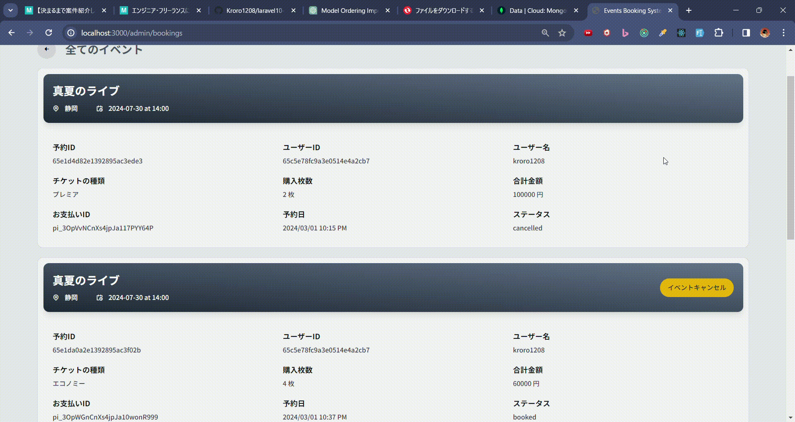
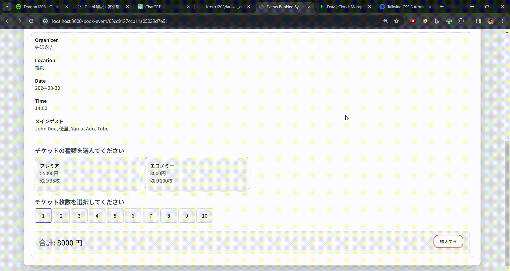
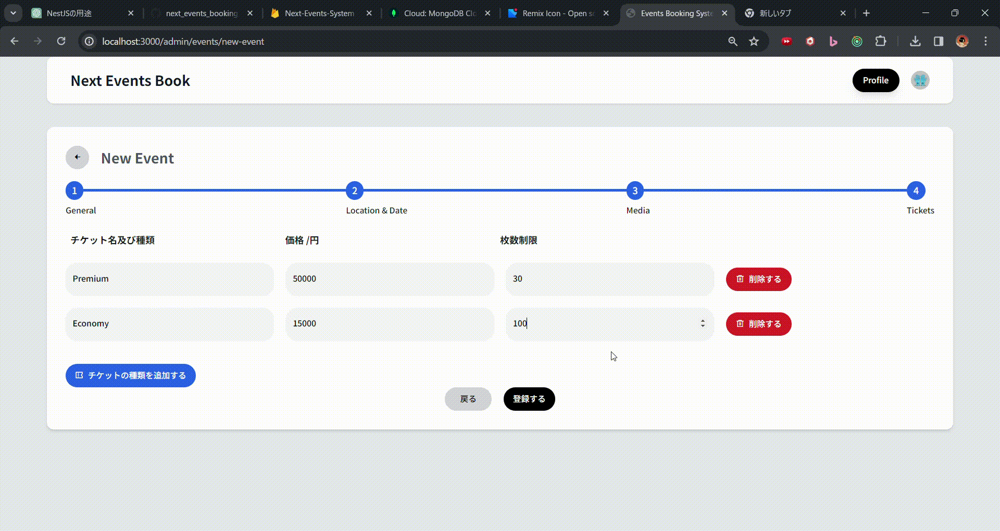

# 環境構築

必要モジュール  
`npm i axios @nextui-org/react framer-motion mongoose dayjs react-hot-toast @clerk/nextjs`

# 途中経過

## 検索機能を実装

## イベントごとの収支を表示

## キャンセルボタンの API 実装

## チケットの枚数と金額が連動

## イベント詳細ページを表示

## イベント登録

## 画像アップロード

